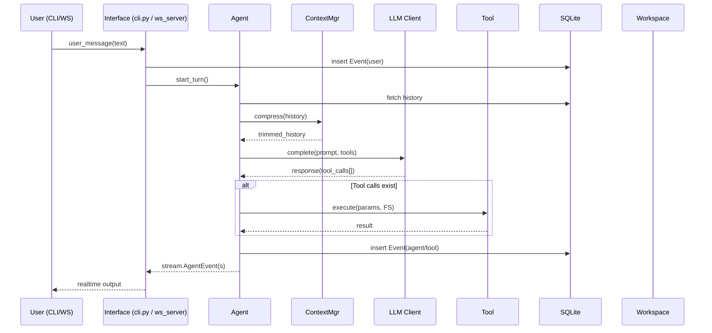

# II-Agent Architecture

II-Agent transforms LLM calls into an **autonomous, tool-using agent** that can operate interactively (CLI / Web UI) or headless (batch).  
This document dives into the technical architecture—layers, components, data flow, and how everything fits together.

---

## 1. Layered View

```
┌───────────────────────┐
│ Interfaces            │  ← Users & external callers
│  • CLI                │
│  • WebSocket API      │
│  • Batch Runner       │
└─────────┬─────────────┘
          │
┌─────────▼─────────────┐
│  Agent Orchestrator   │  ← Reasoning loop
│  • Prompt builder     │
│  • Tool dispatcher    │
└─────────┬─────────────┘
          │
┌─────────▼─────────────┐
│   Core Services       │
│  • Context Managers   │
│  • LLM Clients        │
│  • Tool Implementations│
│  • Utilities          │
└────┬─────┬──────┬────┘
     │     │      │
     │     │      └──────────┐
     │     │                 │
┌────▼──┐ ┌▼────┐   ┌────────▼────────┐
│ DB    │ │FS   │   │ External APIs   │
│SQLite │ │Work │   │  (LLM, Search…) │
└───────┘ └─────┘   └──────────────────┘
```

* **Interfaces** – expose the agent through different I/O channels.  
* **Agent Orchestrator** – the heart: runs the reasoning loop, calls LLM, executes tools.  
* **Core Services** – reusable modules shared by all interfaces.  
* **Data Stores** – durable state: events, sessions, workspaces.

---

## 2. Interfaces

| Interface | Entry Point | Purpose | Output Stream |
|-----------|-------------|---------|---------------|
| **CLI** | `cli.py` | REPL in terminal; optional execution-permission prompts | Stdout (`AgentEvent` JSON / plain text) |
| **WebSocket** | `ws_server.py` | FastAPI server powering React front-end | WS JSON events (realtime) |
| **Batch Runner** | `run_gaia.py` | Non-interactive evaluation on datasets (e.g., GAIA) | Trace files, JSON metrics |

All interfaces create their own **Workspace** directory and instantiate an **Agent** with identical core logic.

---

## 3. Core Components

### 3.1 Agent Layer

* **`AnthropicFC`** (function-calling) – default agent class.  
* Responsibilities  
  1. Collect latest **history** from DB  
  2. Ask **Context Manager** to truncate/summarise  
  3. Build **system + user prompt**  
  4. Call **LLM client**  
  5. Parse `tool_calls` or `final_answer`  
  6. Dispatch to **Tool Manager** if needed  
  7. Persist events, stream outputs, repeat until done

### 3.2 Context Managers

| Manager | Strategy |
|---------|----------|
| `LLMSummarizingContextManager` | Summarise older turns with the LLM itself. |
| `AmortizedForgettingContextManager` | Drop messages by recency & salience. |
| `PipelineContextManager` | Chain multiple strategies. |

### 3.3 LLM Clients

Uniform interface in `llm.base.LLMClient`:

```
complete(prompt: str, tools: list[FuncSchema]) → LLMResponse
```

Implementations:  
* **Anthropic** (direct API)  
* **VertexAI** (Claude on GCP)  
* **OpenAI** (for image / multimodal tools)

### 3.4 Tool Sub-system

* Registry in `tool_manager.py` auto-loads default tools.  
* Each tool derives from `LLMTool`, with the core method being `run_impl`:

```python
def run_impl(self, tool_input: dict[str, Any], message_history: Optional[MessageHistory] = None) -> ToolImplOutput: ...
```

* Categories:
  * **OS / Code** – `bash_tool`, `str_replace_tool`, `presentation_tool`  
  * **Browser** – Playwright automation + CV element detection  
  * **Search & Crawl** – Tavily, Jina, SerpAPI, Firecrawl  
  * **Multimodal** – PDF extract, audio transcribe, image generation

### 3.5 Utilities

* **Token counter** – heuristic cost before API call.  
* **Workspace Manager** – per-session temp dir + static URL mapping.  
* **Prompt Generator / Constants** – canonical system & tool prompts.

---

## 4. Data Stores

| Store | Tech | What is saved | Life-cycle |
|-------|------|---------------|------------|
| **Events DB** | SQLite (SQLAlchemy) | Session, user msg, agent msg, tool results | Persistent between restarts |
| **Workspace FS** | Local disk (temp dir or `./workspace`) | Uploaded assets, generated images/html, code files | Deleted on session expiry (configurable) |

---

## 5. Orchestration & Data Flow

### 5.1 Sequence Diagram (Mermaid)



### 5.2 Loop Termination

* Stops when LLM returns `final_answer` **without** tool calls **or** max-iterations reached.  
* Final answer marked in DB; interface closes session.

---

## 6. Deployment Topologies

| Topology | Description |
|----------|-------------|
| **Local Dev** | Python venv + Playwright install; run CLI or WS server. |
| **Docker Compose** | `docker/backend` & `docker/frontend` images; workspace volume persisted. |
| **Serverless Vertex** | Backend deployed on Cloud Run; secrets in Secret Manager. |

> Static assets produced by tools are served via `/static/{session_uuid}/…` mapped to `STATIC_FILE_BASE_URL`.

---

## 7. Extensibility Points

1. **Add a Tool** – new class → register.  
2. **Swap LLM** – implement `LLMClient`.  
3. **Custom Context Strategy** – subclass `BaseContextManager` or compose.  
4. **Alternate UI** – consume WebSocket event schema.

---

## 8. Component Responsibility Matrix

| Concern | Owner Module |
|---------|--------------|
| Prompt crafting | `prompt_generator.py` |
| Token budgeting | `token_counter.py`, Context Managers |
| File safety | `workspace_manager.py`, permission flags |
| Concurrency | One agent instance per WS connection / CLI session |
| Observability | Logging via `utils.py`, DB trace rows |

---

## 9. Summary

*II-Agent* is organised around clear boundaries:

* **Interfaces** provide transport-agnostic I/O.  
* **Agent Layer** drives reasoning and action.  
* **Core Services** encapsulate token-aware context, LLM calls, and an ever-growing catalog of tools.  
* **Data Stores** ensure reproducibility and replay.  

This architecture enables rapid experimentation with new reasoning strategies while remaining production-ready for real-world automation tasks.
