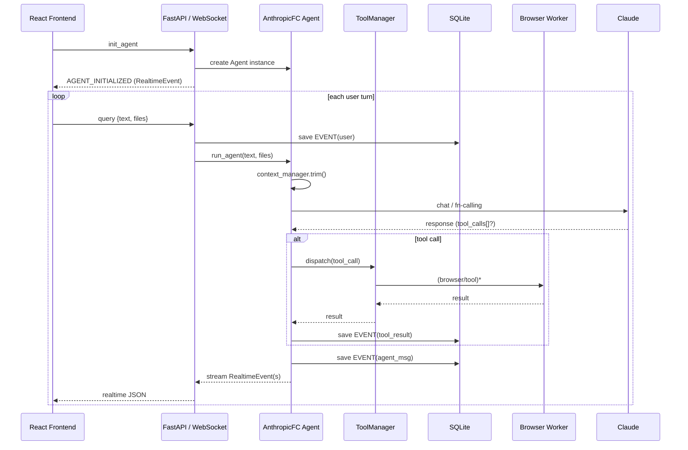

# II-Agent – Technical Overview (✱ v0.2)

II-Agent turns Anthropic Claude 3.x into a **fully-autonomous, tool-using assistant** that speaks over WebSockets, persists every interaction, and executes real code & browser actions inside an isolated workspace.  
This document explains **how the system is actually built**, based on the source code at commit `a6da824`.

---

## 1. Runtime Stack at a Glance

| Layer | Technology | Key Modules |
|-------|------------|-------------|
| API / Transport | **FastAPI** (`ws_server.py`) | REST endpoints + `/ws` WebSocket |
| Real-time Events | **WebSocket** streaming `RealtimeEvent` JSON | `core/event.py` |
| Concurrency | **asyncio** / `anyio` | pervasive `async/await` |
| Orchestration | `AnthropicFC` (function-calling) | `agents/anthropic_fc.py` |
| Context Management | LLM summary & amortised forgetting | `llm/context_manager/*` |
| Tool System | `AgentToolManager` with permission gates | `tools/*` |
| Data Persistence | **SQLite** via SQLAlchemy | `db/` |
| Browser Automation | **Playwright** headless Chromium + CV detector | `browser/*` |
| Workspace | Per-session FS sandbox, static file server | `utils/workspace_manager.py` |

---

## 2. High-Level Flow (one WebSocket connection)



*Every arrow from Agent to WS is an **async put** on an `asyncio.Queue`; the message-processor task forwards it to the client and the DB.*

---

## 3. Core Components

### 3.1 FastAPI WebSocket Server (`ws_server.py`)
* Accepts `/ws` connections; CORS-enabled.
* Spawns:
  * **Agent instance** per connection.
  * **Background `asyncio.Task`** reading an `asyncio.Queue` of `RealtimeEvent`s.
* REST helpers:
  * `POST /api/upload` – base64 / text file upload into session workspace.
  * `GET /api/sessions/{device}` – list previous sessions with first user message.

### 3.2 `AnthropicFC` Agent
* Pure **async** orchestration loop (`run_agent_async` is off-thread via `anyio.to_thread` to avoid blocking).
* Maintains **MessageHistory** using a pluggable **ContextManager**:
  * `LLMSummarizingContextManager` – LLM summarises stale turns.
  * `AmortizedForgettingContextManager` – probabilistically drops messages when near the token budget.
* Handles **interruptions** (client “cancel” / Ctrl-C) and injects synthetic assistant messages so the conversation can resume.

### 3.3 Tool System
* `AgentToolManager` wraps a list of `LLMTool` instances.
* Each tool **validates** JSON parameters (via `jsonschema`) then executes `run_impl`.
* Permission-gated: for risky tools (`bash_tool`) the ToolManager pauses and asks the UI for confirmation unless `--needs-permission false`.
* Tool result can be:
  * Plain text.
  * List of dicts (structured JSON).
  * File paths (stored under `workspace/<session>` and served statically).

### 3.4 Database Layer (`db/`)
* **SQLite** default; write-ahead-log mode to support concurrent readers.
* Tables:
  * `session` – `id`, `device_id`, `workspace_dir`, `created_at`.
  * `event` – chronological stream of every `RealtimeEvent` (type, payload, ts).
* API surfaces in server allow frontend to **replay** a session by streaming stored events.

### 3.5 Browser Automation
* `Browser` wrapper (sync) uses Playwright Chromium.
* `detector.py` performs CV to find visible interactive elements for robust clicking.
* Browser tools live in `tools/browser_tools/` (click, scroll, enter_text, dropdown, etc.).

---

## 4. Context-Management Strategy

| Stage | Action | Token Budget (default 120 k) |
|-------|--------|------------------------------|
| New message | Append user text & file list | +tokens |
| Pre-LLM      | `history.truncate()` <br>1️⃣ Summarise oldest turns until ≤80 % budget <br>2️⃣ Drop low-salience messages until ≤60 % | — |
| Post-LLM     | Persist assistant / tool call / result | Budget checked next turn |

---

## 5. Workspace & File Handling

```
workspace/
 └── <session_uuid>/
      ├── uploads/          # user-uploaded via /api/upload
      ├── browser/          # screenshots, page.html
      ├── outputs/          # tool-generated artifacts
      └── temp/
```

Static files are served under  
`{STATIC_FILE_BASE_URL}/workspace/<session_uuid>/…`.

---

## 6. Error Handling & Cancellation

* **KeyboardInterrupt / client “cancel”** → `Agent.cancel()` sets `self.interrupted=True`; loop injects “Interrupted” messages.
* If a tool exceeds timeouts the agent catches `asyncio.CancelledError`, returns a synthetic response, and keeps history consistent.
* WebSocket disconnect triggers `cleanup_connection`:  
  * Removes tasks from maps but leaves the message processor **running** so DB persistence continues.

---

## 7. Extending II-Agent

1. **Add a Tool** – subclass `LLMTool`, implement `run_impl`, register in `get_system_tools`.
2. **Custom Context Policy** – subclass `BaseContextManager` or chain managers via `PipelineContextManager`.
3. **Alternate Storage** – swap SQLite for Postgres by changing the SQLAlchemy engine URL.
4. **Frontend** – consume `RealtimeEvent` schema; no backend change needed.

---

## 8. Diagram: Deploy-Time Topology (Docker Compose)

```
+---------+      8000/ws      +-----------------+
|  React  | <───────────────> | FastAPI Backend |
| Frontend|                  | (ws_server.py)  |
+---------+                  +----┬------------+
                                  │ asyncio.Queue
                                  │
                           +------+-------+
                           | AnthropicFC  |
                           |   Agent      |
                           +------+-------+
                                  │ Playwright
                                  │
                         +--------▼---------+
                         |   Browser-Worker |
                         +--------┬---------+
                                  │ SQLite (WAL)
                         +--------▼---------+
                         |  session/event   |
                         +------------------+
```

---

## 9. Key Design Decisions

* **Async first** – every network I/O, DB call, and tool dispatch is non-blocking, allowing hundreds of concurrent WebSocket sessions.
* **Stream-Everything** – `RealtimeEvent` transport makes the UI reactive and enables session replay/debugging.
* **Token Budget Control** – proactive summarisation prevents expensive 120 k-token prompts.
* **Isolation by Default** – each connection gets its own workspace dir; dangerous tools require explicit opt-in.

---

_End of Technical Overview_  
