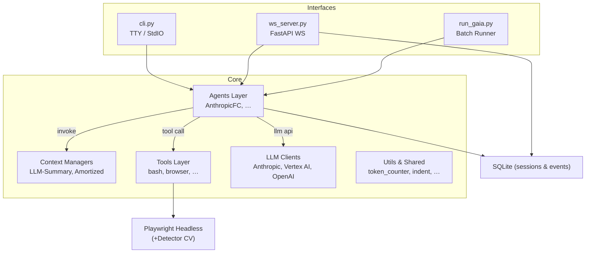

# II-Agent – Technical Overview

II-Agent is an open-source framework that turns Large-Language-Model (LLM) calls into **autonomous agents** capable of planning, tool use, and multimodal reasoning.  
It powers a **command-line interface (CLI)**, a **WebSocket (WS) back-end** that feeds a React front-end, and can also run headless in batch mode for benchmarks such as GAIA.

---

## 1. Project Purpose

* Provide a **batteries-included agent runtime** that can:  
  • converse via text & streaming events  
  • plan multi-step tasks  
  • call external tools (bash, browser, web-search, file editing, …)  
* Offer both **interactive** (CLI / Web UI) and **programmatic** (Python import) interfaces.
* Serve as a **research playground** for experimenting with context-management, reflection loops, and evaluation on agent benchmarks.

---

## 2. High-Level Architecture

---

## 3. Core Components

### 3.1 Interfaces
| Module | File | Highlights |
|--------|------|------------|
| CLI    | `cli.py` | REPL-style loop, streams `AgentEvent`s to stdout, optional permission gate. |
| WS Server | `ws_server.py` | FastAPI + WebSocket, per-connection workspace, emits JSON event stream consumed by React front-end. |
| Batch Runner | `run_gaia.py` | Iterates over GAIA dataset, executes tasks, stores traces. |

### 3.2 Agents Layer
* **`AnthropicFC`** (function-calling) orchestrates the reasoning loop:  
  1. Build prompt with system text + history via Context Manager.  
  2. Call LLM; parse tool calls / final answer.  
  3. Execute tools; append results to history; repeat until `finished`.  
* Plug-and-play: new agents can inherit `agents.base.BaseAgent`.

### 3.3 LLM Clients (`src/ii_agent/llm`)
* **Anthropic** via official SDK.  
* **Vertex AI** wrapper for Claude models hosted on Google Cloud.  
* **OpenAI** optional for image/video generation tools.  
All share a `llm.base.LLMClient` interface (sync, token counting helpers).

### 3.4 Context Managers (`src/ii_agent/llm/context_manager`)
| Manager | Purpose |
|---------|---------|
| `LLMSummarizingContextManager` | Summarises older turns to stay under token budget. |
| `AmortizedForgettingContextManager` | Drops least-salient messages gradually. |
| `PipelineContextManager` | Chain multiple managers for custom strategies. |

### 3.5 Tools Layer (`src/ii_agent/tools`)
* **Primitive**: `bash_tool`, `str_replace_tool`, `markdown_converter`, …  
* **Browser**: visit page, click element, list links; built atop **Playwright** + CV detector.  
* **Research**: web search, deep research orchestrator.  
* **Multimodal**: pdf extract, audio transcribe, image generation.

Tools implement `tools.base.Tool` (signature: `call(parameters, workspace, message_queue)`).

### 3.6 Database
* Simple **SQLite** via SQLAlchemy (`db/`) holds:
  * `Session` rows – device & workspace info  
  * `Event` rows – user/agent messages, tool results (used for replay)  

### 3.7 Utilities
* `token_counter` – rough token estimator for multiple models.  
* `workspace_manager` – per-connection isolation, temp dirs, file serving.  
* `prompt_generator`, `indent_utils`, `constants` – glue code for robust prompts.

---

## 4. Data Flow

1. **Input** (user message via CLI / WS) → persisted as `Event`.  
2. Agent loop builds **prompt** using `ContextManager` (history + system).  
3. **LLM Client** completes; response may contain `tool_calls[]`.  
4. For each call, **Tool Manager** dispatches to concrete Tool → returns result.  
5. Result appended to history; agent decides to **continue** (go to step 2) or **finish** (produce `final_answer`).  
6. All intermediate and final outputs stream back to client (stdout or WS).  
7. Assets from tools (images, html files) stored in workspace and served via static file endpoint (`STATIC_FILE_BASE_URL`).

---

## 5. Deployment & Run Modes

| Mode | Command | Notes |
|------|---------|-------|
| **Local CLI** | `python cli.py` | Fastest way to try; asks for permission before exec if `--needs-permission`. |
| **Web UI (Dev)** | `python ws_server.py --port 8000` + `cd frontend && npm run dev` | React/NextJS hot-reload; connects to WS backend. |
| **Docker Compose** | `./start.sh` | Spins up backend (Python-uvicorn) + frontend + optional db. |
| **Vertex AI** | Set `GOOGLE_APPLICATION_CREDENTIALS`, run with `--project-id` & `--region`. |
| **Benchmark Batch** | `python run_gaia.py --task-uuid ...` | Generates trace logs & JSON results for GAIA. |

**Environment Variables** live in `.env` (backend) and `frontend/.env`.

---

## 6. Extensibility

| Extension Point | How to Add |
|-----------------|------------|
| **New Tool** | Create class inheriting `Tool`, register in `tools.__init__`, add to `tool_manager.register_default_tools()`. |
| **New Agent** | Subclass `BaseAgent`, override `create_prompt()` / `extract_tool_calls()`. |
| **Custom Context Strategy** | Compose managers via `PipelineContextManager` or implement `ContextManagerProtocol`. |
| **Alternate LLM** | Implement `LLMClient` with `complete()` and `tokenizer`. |
| **Frontend Plugins** | Add new action icons + API routes consuming WS events. |

All public APIs are type-hinted; new modules should include docstrings and unit tests.

---

## 7. Testing Strategy

* **Unit tests** in `tests/` cover:
  * LLM context management (`test_context_manager/`)  
  * Tool logic (`test_bash_tool.py`, …)  
  * Message history truncation.
* **Integration tests** spin up an agent end-to-end with a dummy LLM stub.
* **Pre-commit** runs `ruff`, `black --check`, and `pytest -q`. CI fails fast.
* **Playwright** browser tools have recorded fixtures for headless tests (CI safe).
* **Benchmark scripts** can be run on a subset of GAIA tasks to ensure regression-free reasoning.

---

## 8. Additional Resources

* [README.md](../README.md) – Quick-start & installation  
* [docs/examples.md](examples.md) – Step-by-step demos  
* [CONTRIBUTING.md](../CONTRIBUTING.md) – Developer workflow  
* [GAIA benchmark traces](https://ii-agent-gaia.ii.inc/) – Live run examples  

---

**II-Agent** aims to bridge LLM reasoning and real-world execution.  
Feel free to explore the codebase, try the agent, and extend it with your own ideas!
